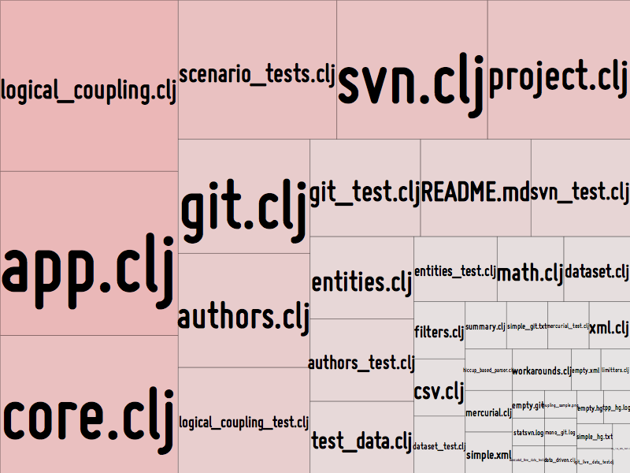

# MetricsTreeMap

This visualization utility is a set of Processing sketches used to present data as tree maps.

## Tree maps

I use this sketch to visualize output from [Code Maat](https://github.com/adamtornhill/code-maat), my software analysis tool:

.

The tree map above is a visualization of all modules in [Code Maat](https://github.com/adamtornhill/code-maat) weighted and coloured by their evolutionary change frequency.

A tree map is basically an algorithm for visualizing the relative sizes of its different items. The algorithm works by subdividing the 2D space into smaller rectangles. The algorithm looks for a space-optimal layout (which is a hard problem in terms of CPU cycles).

### Layout algorithms
`MetricsTreeMap` supports a number of different layout algorithms. Just press the keys `1-5` while running the sketch to switch layout. For example, here's the default dynamic map layout of the same data:

.

### Saving a visualization
If you want to save a tree map to file, press `s`. The file will be post-fixed with the current date and time so you can save multiple versions with different layouts in the same directory.

### Getting started

The `MetricsTreeMap` sketch reads its data from any file named `metric_data.csv` (yes, it's hardcoded in the sketch). The `csv` file is expected to have two columns:

           1) The name of the module/entity, and 
           2) The metric itself. The metric is used as weight in the tree map.

For example:

           src/code_maat/analysis/logical_coupling.clj,  26
           src/code_maat/app/app.clj,                    25
           src/code_maat/core.clj,                       21
           test/code_maat/end_to_end/scenario_tests.clj, 20
           src/code_maat/parsers/svn.clj,                19

Just put your `metric_data.csv` file into the sketch folder and run the application in Processing. Enjoy your visualized data and I hope you find the sketch useful.

## Implementation notes
The implementation is done in the Processing language with a good ol' imperative coding style. There's something special about the interactive feeling and ease of experimantation that Processing provides.
The tree map library has support for hierarchical structures too, so that's probably something I'll add in future versions.

## Credits
I've based the general structure on the code in `Visualizing Data: Exploring and Explaining Data with the Processing Environment` by `Ben Fry`.

The idea and technique to optimize the text font is from the book `Generative Design: Visualize, Program, and Create with Processing` by `Hartmut Bohnacker`, `Benedikt Gross`, `Julia Laub`, and `Claudius Lazzeroni`. 

Both of these books are good reads with lots of useful information and techniques - recommended.